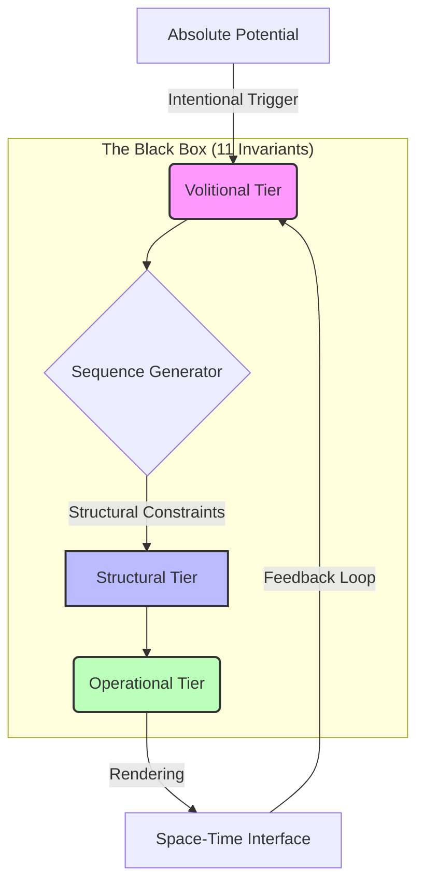

# Sequence-First Reality Architecture (SFRA)

## Overview
SFRA is a theoretical framework postulating that **Sequence is primary**, while Space-Time is a secondary "rendering" interface. This model provides an alternative explanation for gravity, dark matter, and singularities through the lens of computational density and algorithmic constraints.

The Video Game Analogy: Imagine a high-end simulation. The Sequence is the CPU processing logic and memory state. Space-Time is the image on your monitor. Gravity is the "frame rate drop" that occurs when the CPU is overloaded by too many objects (data density) in one area. You cannot fix the lag by touching the monitor; you must optimize the underlying code.

## Core Postulates
1. **The Sequence Invariant:** Reality is a stream of logical operations (sequences) originating from an initial potential state.
2. **Computational Gravity:** Gravity is not a force but the result of increased sequence density (sampling rate) in high-data clusters.
3. **The Rendering Interface:** Space-Time is a human-centric UI designed to perceive discrete sequences as a continuous fabric.

## System Architecture Layers

The framework operates through three distinct logical tiers, ensuring stability and autonomy of the sequence:

* **Volitional Tier (Input):** Processes primary intents and determines the vector of sequence deployment. It acts as the initial "why" and "where" of the process.
* **Structural Tier (Processing):** The level of logical constraints. It maintains the critical balance between system expansion and structural integrity, preventing sequence collapse.
* **Operational Tier (Output):** The interface of interaction with the environment. Responsible for practical execution, stability, and processing feedback loops from the "rendered" reality.


## "What it explains"
## Phenomenon Comparison Table

This table illustrates how SFRA reinterprets fundamental physical concepts through the lens of Sequence Primacy:

| Phenomenon | Standard Physics Explanation | SFRA Explanation |
| :--- | :--- | :--- |
| **Gravity** | Spacetime Curvature | Local increase in Sequence Density (Computational load) |
| **Time Dilation** | Relativistic effect | Computational lag due to high data processing density |
| **Dark Matter** | Unknown particle | Background system processes (The Hidden Stack) |
| **Entropy** | Increase in disorder | Decay of sequence coherence and algorithmic synchronization |


## Running the Simulation

To visualize the **Computational Lag** and **Sequence Density** in real-time, you can run our Python-based diagnostic tool:

### Prerequisites:
* Python 3.x
* Libraries: `pip install numpy matplotlib`

### Execution:
```bash
python3 sfra_sim.py

This simulation renders a dual-window interface:

Left: A heatmap of Sequence Density Clusters.

Right: Real-time System Clock Rate (Hz) telemetry.
```
> *Note: The specific mapping and logic of the 11 Invariants are intentionally omitted to preserve system integrity.*
