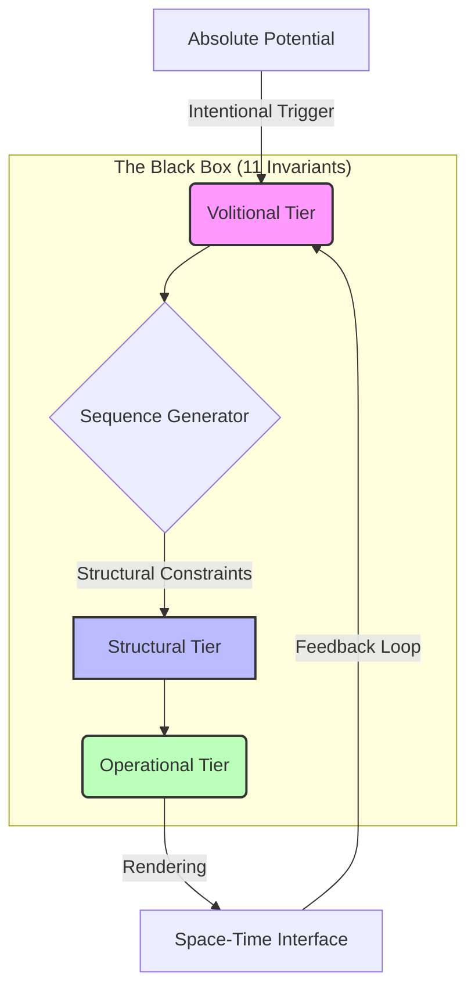

# Sequence-First Reality Architecture (SFRA)

## Overview
SFRA is a theoretical framework postulating that **Sequence is primary**, while Space-Time is a secondary "rendering" interface. This model provides an alternative explanation for gravity, dark matter, and singularities through the lens of computational density and algorithmic constraints.

The Video Game Analogy: Imagine a high-end simulation. The Sequence is the CPU processing logic and memory state. Space-Time is the image on your monitor. Gravity is the "frame rate drop" that occurs when the CPU is overloaded by too many objects (data density) in one area. You cannot fix the lag by touching the monitor; you must optimize the underlying code.

## Core Postulates
1. **The Sequence Invariant:** Reality is a stream of logical operations (sequences) originating from an initial potential state.
2. **Computational Gravity:** Gravity is not a force but the result of increased sequence density (sampling rate) in high-data clusters.
3. **The Rendering Interface:** Space-Time is a human-centric UI designed to perceive discrete sequences as a continuous fabric.

## System Layers
The architecture is governed by a proprietary set of **11 System Invariants** (Core Logic), organized into three functional tiers:
* **The Volitional Tier:** Initiation and direction of sequences.
* **The Structural Tier:** Management of constraints, balance, and invariants.
* **The Realization Tier:** Stability, practical execution, and feedback loops.

> *Note: The specific mapping and logic of the 11 Invariants are intentionally omitted to preserve system integrity.*
